# 🚀 Self-Hosted LLM with RAG

A complete, production-ready platform for running large language models and RAG (Retrieval-Augmented Generation) applications entirely on your own hardware. Built with Kubernetes, optimized for AMD GPUs, and designed for privacy-first AI deployments.

## 🎯 Overview

This project provides two integrated components:

1. **LLM Infrastructure Stack** (`llm-infrastructure/`) - The foundation for running local LLMs
2. **RAG Application** (`rag-app/`) - Document Q&A system with hybrid search

## 🏗️ Architecture

```mermaid
graph TB
    subgraph "External Access"
        User[👤 User]
        Tunnel[Cloudflare Tunnel<br/>Port 8080]
    end

    subgraph "Kubernetes Cluster - llm-stack namespace"
        subgraph "RAG Application"
            RAGAPI[RAG API<br/>FastAPI<br/>Port 8080]
            Frontend[Frontend<br/>HTML/JS]
        end

        subgraph "LLM Infrastructure"
            Ollama[Ollama<br/>Port 11434<br/>---<br/>Models:<br/>• llama3<br/>• mxbai-embed-large<br/>• nomic-embed-text]
            LiteLLM[LiteLLM Proxy<br/>Port 4000<br/>OpenAI-compatible API]
        end

        subgraph "Storage Layer"
            ChromaDB[(ChromaDB<br/>Port 8000<br/>Vector Database)]
            Meilisearch[(Meilisearch<br/>Port 7700<br/>Keyword Search)]
        end

        subgraph "Optional Services"
            OpenWebUI[Open WebUI<br/>Port 3000<br/>Chat Interface]
        end
    end

    %% User interactions
    User -->|Upload PDF<br/>Query| Frontend
    User -.->|Optional| Tunnel
    Tunnel -.-> RAGAPI
    Frontend --> RAGAPI

    %% Document Ingestion Flow
    RAGAPI -->|1. Parse PDF<br/>Docling| RAGAPI
    RAGAPI -->|2. Chunk Text| RAGAPI
    RAGAPI -->|3. Get Embeddings| LiteLLM
    LiteLLM -->|ollama/mxbai-embed-large| Ollama
    RAGAPI -->|4. Store Vectors| ChromaDB
    RAGAPI -->|5. Store Text| Meilisearch

    %% Query Flow
    RAGAPI -->|6. Embed Query| LiteLLM
    RAGAPI -->|7. Vector Search| ChromaDB
    RAGAPI -->|8. Keyword Search| Meilisearch
    RAGAPI -->|9. Hybrid Retrieval| RAGAPI
    RAGAPI -->|10. Generate Answer| LiteLLM
    LiteLLM -->|ollama/llama3| Ollama

    %% Optional WebUI
    OpenWebUI -.->|Alternative UI| LiteLLM

    classDef userNode fill:#e1f5ff,stroke:#01579b,stroke-width:2px
    classDef apiNode fill:#fff3e0,stroke:#e65100,stroke-width:2px
    classDef llmNode fill:#f3e5f5,stroke:#4a148c,stroke-width:2px
    classDef storageNode fill:#e8f5e9,stroke:#1b5e20,stroke-width:2px
    classDef optionalNode fill:#f5f5f5,stroke:#757575,stroke-width:1px,stroke-dasharray: 5 5

    class User,Tunnel userNode
    class RAGAPI,Frontend apiNode
    class Ollama,LiteLLM llmNode
    class ChromaDB,Meilisearch storageNode
    class OpenWebUI optionalNode
```



## ✨ Key Features

- 🔒 **100% Self-Hosted** - All data stays on your infrastructure
- 🚀 **Production-Ready** - Kubernetes orchestration with persistent storage
- 💪 **AMD GPU Optimized** - ROCm support for Radeon 780M iGPU
- 🔍 **Hybrid Search** - Combines semantic (vector) + keyword (BM25) search
- 📄 **Advanced PDF Parsing** - Layout-aware extraction with Docling
- ⚡ **Fast & Scalable** - Async processing with batch embeddings
- 🌐 **OpenAI Compatible** - Use familiar APIs with local models
- 🔐 **Secure Remote Access** - Cloudflare Tunnel (no port forwarding)

## 📦 Components

| Component | Purpose | Technology | Port |
|-----------|---------|------------|------|
| **Ollama** | LLM & embedding runtime | ROCm, AMD optimized | 11434 |
| **LiteLLM** | OpenAI-compatible proxy | Python, routing | 4000 |
| **ChromaDB** | Vector database | SQLite, embeddings | 8000 |
| **Meilisearch** | Keyword search engine | Rust, BM25 | 7700 |
| **RAG API** | Document Q&A backend | FastAPI, LangChain | 8080 |
| **PostgreSQL** | Token tracking | PostgreSQL 15 | 5432 |
| **Open WebUI** | Optional chat interface | Svelte | 3000 |

## 🚀 Quick Start

### 1. Deploy LLM Infrastructure

```bash
cd llm-rag-app/llm-infrastructure

# Configure BIOS (4-8GB UMA frame buffer for AMD GPU)
# Install k3s and apply manifests
kubectl apply -f manifests/
```

See [llm-infrastructure/README.md](llm-infrastructure/README.md) for detailed instructions.

### 2. Deploy RAG Application

```bash
cd llm-rag-app/rag-app

# Local development
./local.sh

# Or deploy to Kubernetes
docker build -t rag-api:latest .
kubectl apply -f k8s/02-rag-api.yaml
```

See [rag-app/README.md](rag-app/README.md) for detailed instructions.

## 📖 Documentation

- **[LLM Infrastructure Guide](llm-infrastructure/README.md)** - Deploy Ollama, LiteLLM, ChromaDB, Meilisearch
- **[RAG Application Guide](rag-app/README.md)** - Build and run the document Q&A system
- **[API Documentation](http://localhost:8080/docs)** - Interactive API docs (when running)

## 💻 Hardware Requirements

### Recommended
- **CPU**: AMD Ryzen 7 7840HS/8845HS (8 cores)
- **GPU**: AMD Radeon 780M iGPU with 4-8GB VRAM
- **RAM**: 32GB (64GB for larger models)
- **Storage**: 256GB+ NVMe SSD

### Minimum
- **CPU**: 4+ cores
- **RAM**: 16GB
- **Storage**: 100GB

### Tested Hardware
- GMKtec NucBox K12 (AMD Ryzen 7 8845HS, 32GB RAM)
- Works on Intel systems without GPU acceleration

## 🛠️ Technology Stack

**Infrastructure:**
- Kubernetes (k3s)
- Docker/containerd
- AMD ROCm (GPU acceleration)
- Cloudflare Tunnel (optional)

**LLM & Embeddings:**
- Ollama (model runtime)
- LiteLLM (API proxy)
- Models: llama3, mxbai-embed-large

**Data Storage:**
- ChromaDB (vector database)
- Meilisearch (search engine)
- PostgreSQL (usage tracking)

**Application:**
- FastAPI (Python backend)
- LangChain (RAG framework)
- Docling (PDF parsing)
- HTML/CSS/JS (frontend)

## 🎯 Use Cases

- 📚 **Internal Knowledge Base** - Company documents search
- ⚖️ **Legal/Medical Q&A** - Compliance-focused document analysis
- 🔬 **Research Assistant** - Academic paper analysis
- 💼 **Customer Support** - Technical documentation retrieval
- 🏢 **Enterprise AI** - Privacy-first alternative to cloud AI

## 🔐 Security & Privacy

- ✅ All processing happens locally
- ✅ No data sent to external APIs
- ✅ Kubernetes NetworkPolicies supported
- ✅ API key authentication
- ✅ Optional Cloudflare Zero Trust integration

## 📊 Performance

**Document Ingestion:**
- ~8-10 seconds per PDF (29 pages)
- ~70 chunks per document (400 char chunks)
- Batch embedding processing

**Query Response:**
- Hybrid search: <500ms
- LLM generation: 2-5 seconds
- Total response: <6 seconds

## 🤝 Contributing

Contributions welcome! Areas of interest:
- Additional embedding models
- Improved chunking strategies
- Advanced retrieval methods
- Performance optimizations
- Documentation improvements

## 📝 License

See LICENSE file in each component directory.

## 🆘 Support

**Common Issues:**
1. Check [llm-infrastructure troubleshooting](llm-infrastructure/README.md#troubleshooting)
2. Check [rag-app troubleshooting](rag-app/README.md#-troubleshooting)
3. Verify all pods are running: `kubectl get pods -n llm-stack`

**Useful Commands:**
```bash
# Check infrastructure status
kubectl get all -n llm-stack

# View logs
kubectl logs -n llm-stack deployment/litellm -f
kubectl logs -n llm-stack deployment/rag-api -f

# Test Ollama
kubectl exec -n llm-stack pod/ollama-0 -- ollama list

# Port forward for local access
kubectl port-forward -n llm-stack service/rag-api 8080:8080
```

## 🌟 Acknowledgments

Built with:
- [Ollama](https://ollama.ai/) - Local LLM runtime
- [LiteLLM](https://docs.litellm.ai/) - LLM proxy
- [LangChain](https://www.langchain.com/) - RAG framework
- [ChromaDB](https://www.trychroma.com/) - Vector database
- [Meilisearch](https://www.meilisearch.com/) - Search engine
- [Docling](https://github.com/DS4SD/docling) - Document parsing

---

**Made with ❤️ for self-hosted AI**
