# 🚀 Self-Hosted LLM with RAG

A complete, production-ready platform for running large language models and RAG (Retrieval-Augmented Generation) applications entirely on your own hardware. Built with Kubernetes, optimized for AMD GPUs, and designed for privacy-first AI deployments.

## 🎯 Overview

This project provides two integrated components:

1. **LLM Infrastructure Stack** (`llm-infrastructure/`) - The foundation for running local LLMs
2. **RAG Application** (`rag-app/`) - Document Q&A system with hybrid search

## 🏗️ Architecture

### High-Level System Architecture

```mermaid
graph TB
    subgraph "External Access"
        User[👤 User]
        Tunnel[Cloudflare Tunnel<br/>Port 8080]
    end

    subgraph "Kubernetes Cluster - llm-stack namespace"
        subgraph "RAG Application"
            RAGAPI[RAG API<br/>FastAPI<br/>Port 8080<br/>---<br/>• PDF Ingestion<br/>• Query Processing<br/>• Langfuse Instrumented]
            Frontend[Frontend<br/>HTML/JS<br/>---<br/>• File Upload<br/>• Chat Interface]
        end

        subgraph "LLM Infrastructure"
            Ollama[Ollama<br/>Port 11434<br/>AMD ROCm GPU<br/>---<br/>Models:<br/>• llama3<br/>• mxbai-embed-large<br/>• nomic-embed-text]
            LiteLLM[LiteLLM Proxy<br/>Port 4000<br/>---<br/>OpenAI-compatible API<br/>Routes to Ollama]
        end

        subgraph "RAG Storage Layer"
            ChromaDB[(ChromaDB<br/>Port 8000<br/>---<br/>Vector Database<br/>Embeddings Storage)]
            Meilisearch[(Meilisearch<br/>Port 7700<br/>---<br/>Keyword Search<br/>BM25 Engine)]
        end

        subgraph "Observability Platform - Langfuse"
            LangfuseWeb[Langfuse Web UI<br/>Port 3000<br/>---<br/>• Dashboard<br/>• Traces Viewer<br/>• Analytics]
            LangfuseWorker[Langfuse Worker<br/>---<br/>• Background Jobs<br/>• Data Ingestion<br/>• Migrations]
        end

        subgraph "Langfuse Storage"
            LFPostgres[(PostgreSQL<br/>Port 5432<br/>---<br/>Metadata & State)]
            LFClickHouse[(ClickHouse<br/>Ports 8123/9000<br/>---<br/>Traces & Analytics)]
            LFRedis[(Redis<br/>Port 6379<br/>---<br/>Queue & Cache)]
            LFMinIO[(MinIO S3<br/>Port 9000<br/>---<br/>Blob Storage)]
        end

        subgraph "Optional Services"
            OpenWebUI[Open WebUI<br/>Port 3000<br/>---<br/>Alternative Chat UI]
            LiteLLMDB[(PostgreSQL<br/>Port 5432<br/>---<br/>Token Tracking)]
        end
    end

    %% User interactions
    User -->|Upload PDF<br/>Query Documents| Frontend
    User -.->|Optional Remote| Tunnel
    Tunnel -.-> RAGAPI
    Frontend --> RAGAPI

    %% Document Ingestion Flow
    RAGAPI -->|1. Parse PDF<br/>Docling OCR| RAGAPI
    RAGAPI -->|2. Chunk Text<br/>400 chars| RAGAPI
    RAGAPI -->|3. Batch Embeddings<br/>mxbai-embed-large| LiteLLM
    LiteLLM -->|Forward Request| Ollama
    RAGAPI -->|4. Store Vectors<br/>1024 dimensions| ChromaDB
    RAGAPI -->|5. Index Text<br/>BM25| Meilisearch

    %% Query Flow
    RAGAPI -->|6. Embed Query| LiteLLM
    RAGAPI -->|7. Vector Search<br/>top_k=5| ChromaDB
    RAGAPI -->|8. Keyword Search<br/>top_k=5| Meilisearch
    RAGAPI -->|9. Ensemble Retrieval<br/>Deduplicate| RAGAPI
    RAGAPI -->|10. Generate Answer<br/>llama3 with context| LiteLLM
    LiteLLM -->|Inference| Ollama

    %% Langfuse Observability Flow
    RAGAPI -.->|Send Traces<br/>Callbacks| LangfuseWeb
    LangfuseWeb -->|Store Metadata| LFPostgres
    LangfuseWeb -->|Queue Events| LFRedis
    LangfuseWorker -->|Poll Jobs| LFRedis
    LangfuseWorker -->|Write Analytics| LFClickHouse
    LangfuseWorker -->|Store Blobs| LFMinIO

    %% Optional WebUI
    OpenWebUI -.->|Alternative UI| LiteLLM
    LiteLLM -.->|Log Usage| LiteLLMDB

    classDef userNode fill:#e1f5ff,stroke:#01579b,stroke-width:2px
    classDef apiNode fill:#fff3e0,stroke:#e65100,stroke-width:2px
    classDef llmNode fill:#f3e5f5,stroke:#4a148c,stroke-width:2px
    classDef storageNode fill:#e8f5e9,stroke:#1b5e20,stroke-width:2px
    classDef obsNode fill:#fff9c4,stroke:#f57f17,stroke-width:2px
    classDef optionalNode fill:#f5f5f5,stroke:#757575,stroke-width:1px,stroke-dasharray: 5 5

    class User,Tunnel userNode
    class RAGAPI,Frontend apiNode
    class Ollama,LiteLLM llmNode
    class ChromaDB,Meilisearch,LFPostgres,LFClickHouse,LFRedis,LFMinIO,LiteLLMDB storageNode
    class LangfuseWeb,LangfuseWorker obsNode
    class OpenWebUI optionalNode
```



### Detailed RAG Query Flow


### Document Ingestion Pipeline

```mermaid
flowchart TD
    Start([User Uploads PDF]) --> Parse[Docling PDF Parser<br/>---<br/>• Layout Analysis<br/>• Table Extraction<br/>• OCR if needed]
    Parse --> Extract[Extract Text & Metadata<br/>---<br/>• Title<br/>• Content<br/>• Page numbers]
    Extract --> Chunk[Chunking Strategy<br/>---<br/>• 400 char chunks<br/>• 50 char overlap<br/>• Preserve structure]

    Chunk --> BatchEmbed[Batch Embedding<br/>---<br/>• Model: mxbai-embed-large<br/>• Batch size: 10 chunks<br/>• Output: 1024-dim vectors]

    BatchEmbed --> LiteLLM[LiteLLM Proxy<br/>OpenAI-compatible]
    LiteLLM --> Ollama[Ollama Runtime<br/>AMD ROCm GPU]
    Ollama --> Vectors[Embedding Vectors]

    Vectors --> StoreChroma[Store in ChromaDB<br/>---<br/>• Collection per document<br/>• Metadata attached<br/>• Persistent storage]

    Chunk --> StoreMeili[Store in Meilisearch<br/>---<br/>• Full-text index<br/>• BM25 ranking<br/>• Fast keyword search]

    StoreChroma --> Complete([Ingestion Complete])
    StoreMeili --> Complete

    Complete --> Ready[Document Ready for Queries]

    style Parse fill:#e3f2fd
    style Chunk fill:#fff3e0
    style BatchEmbed fill:#f3e5f5
    style StoreChroma fill:#e8f5e9
    style StoreMeili fill:#e8f5e9
    style Complete fill:#c8e6c9
```



## ✨ Key Features

- 🔒 **100% Self-Hosted** - All data stays on your infrastructure
- 🚀 **Production-Ready** - Kubernetes orchestration with persistent storage
- 💪 **AMD GPU Optimized** - ROCm support for Radeon 780M iGPU
- 🔍 **Hybrid Search** - Combines semantic (vector) + keyword (BM25) search
- 📄 **Advanced PDF Parsing** - Layout-aware extraction with Docling
- ⚡ **Fast & Scalable** - Async processing with batch embeddings
- 🌐 **OpenAI Compatible** - Use familiar APIs with local models
- 🔐 **Secure Remote Access** - Cloudflare Tunnel (no port forwarding)
- 📊 **Complete Observability** - Langfuse integration for LLM tracing, cost tracking, and analytics

### 🔭 Langfuse Observability Features

The platform includes comprehensive LLM observability through Langfuse v3:

**Tracing & Debugging:**
- 📈 **Trace Every Request** - Complete visibility into RAG pipeline execution
- 🔍 **Span-Level Details** - See individual embedding, retrieval, and generation steps
- ⏱️ **Latency Analysis** - Identify bottlenecks in your RAG chain
- 🐛 **Error Tracking** - Catch and debug LLM failures

**Cost & Usage Analytics:**
- 💰 **Token Tracking** - Count prompt and completion tokens per request
- 📊 **Cost Dashboard** - Monitor spending across models and users
- 📈 **Usage Trends** - Visualize patterns over time
- 🎯 **Per-Model Stats** - Compare performance of different LLMs

**Quality Management:**
- ⭐ **Score Traces** - Add human or automated feedback scores
- 📝 **Session Tracking** - Group related queries by user/conversation
- 🔄 **A/B Testing** - Compare prompt variations
- 📋 **Prompt Versioning** - Manage and track prompt templates

**Data Storage:**
- **PostgreSQL**: User accounts, projects, API keys
- **ClickHouse**: High-performance trace analytics and queries
- **Redis**: Job queue and caching layer
- **MinIO**: Long-term event log and blob storage

**Accessing Langfuse UI:**

The Langfuse service is exposed via **NodePort 30000** for direct access from your network:

```bash
# Access directly via node IP (no port-forward needed)
# Open http://<your-node-ip>:30000
# Example: http://192.168.1.100:30000

# Or use port-forward for localhost access
kubectl port-forward -n llm-stack svc/langfuse 30000:3000
# Open http://localhost:30000
```

**First-time Setup:**
1. Open the Langfuse UI in your browser
2. Create the first admin account
3. Create a project for your RAG application
4. Generate API keys (Public Key & Secret Key)
5. Update the keys in `llm-infrastructure/manifests/001-secrets.yaml`
6. Apply the updated secrets and restart the RAG API

See [llm-infrastructure/LANGFUSE-SETUP.md](llm-infrastructure/LANGFUSE-SETUP.md) for detailed instructions.

## 📦 Components

| Component | Purpose | Technology | Port | Resources |
|-----------|---------|------------|------|-----------|
| **Ollama** | LLM & embedding runtime | ROCm, AMD optimized | 11434 | GPU access |
| **LiteLLM** | OpenAI-compatible proxy | Python, routing | 4000 | CPU only |
| **ChromaDB** | Vector database | SQLite, embeddings | 8000 | Persistent storage |
| **Meilisearch** | Keyword search engine | Rust, BM25 | 7700 | Fast indexing |
| **RAG API** | Document Q&A backend | FastAPI, LangChain | 8080 | Async processing |
| **Langfuse Web** | Observability dashboard | Next.js, Prisma | 3000 (NodePort: 30000) | UI for traces |
| **Langfuse Worker** | Background processing | Node.js | - | Event ingestion |
| **PostgreSQL (Langfuse)** | Metadata storage | PostgreSQL 15 | 5432 | Langfuse state |
| **ClickHouse** | Analytics database | ClickHouse | 8123/9000 | Trace analytics |
| **Redis** | Queue & cache | Redis 7 | 6379 | Job queue |
| **MinIO** | S3-compatible storage | MinIO | 9000 | Blob storage |
| **PostgreSQL (LiteLLM)** | Token tracking | PostgreSQL 15 | 5432 | Usage logs |
| **Open WebUI** | Optional chat interface | Svelte | 8080 | Alternative UI |

## 🚀 Quick Start

### For Complete Beginners

This project runs a complete AI system on your own computer (no cloud needed!). Here's what you'll do:

1. **Set up the infrastructure** - Install all the AI tools and databases
2. **Deploy the RAG app** - Upload documents and ask questions about them
3. **Monitor with Langfuse** - See how your AI is performing

### 1. Deploy LLM Infrastructure

```bash
cd llm-rag-app/llm-infrastructure

# IMPORTANT: First configure your BIOS
# - Restart your computer and enter BIOS (usually Del or F7 key)
# - Find "Graphics Settings" or "UMA Frame Buffer"
# - Set it to 4GB or 8GB (this gives your GPU enough memory)
# - Save and exit

# Install Kubernetes (k3s) - this manages all our services
curl -sfL https://get.k3s.io | sh -s - --disable traefik

# Wait a minute for k3s to start, then apply all configurations
kubectl apply -f manifests/000-config.yaml
kubectl apply -f manifests/001-secrets.yaml
kubectl apply -f manifests/

# Wait for everything to start (this may take 5-10 minutes)
kubectl get pods -n llm-stack -w
# Press Ctrl+C when all pods show "Running" status
```

See [llm-infrastructure/README.md](llm-infrastructure/README.md) for detailed instructions.

### 2. Deploy RAG Application

```bash
cd llm-rag-app/rag-app

# For beginners: Test locally first (easier to debug)
# This creates a Python virtual environment and installs dependencies
python3 -m venv test
source test/bin/activate
pip install -r requirements.txt

# Run the local development server
# This script automatically connects to all the services in Kubernetes
./local.sh

# Your app is now running!
# Open your browser to http://localhost:8080
# - Upload a PDF document
# - Ask questions about it
# - Get AI-powered answers!

# For production: Deploy to Kubernetes
# Build the Docker image
docker build -t rag-api:latest .

# If using k3s, import the image
docker save rag-api:latest | sudo k3s ctr images import -

# Deploy to Kubernetes
kubectl apply -f k8s/02-rag-api.yaml

# Access via port-forward
kubectl port-forward -n llm-stack service/rag-api 8080:8080
```

See [rag-app/README.md](rag-app/README.md) for detailed instructions.

### 3. Setup Langfuse Observability

```bash
# Langfuse is already deployed with NodePort access
# Access Langfuse UI directly via your node IP
# Example: http://192.168.1.100:30000
# Or use localhost if on the same machine: http://localhost:30000

# For port-forward access (optional):
kubectl port-forward -n llm-stack svc/langfuse 30000:3000
# Open http://localhost:30000

# First-time setup in the UI:
# 1. Create your first admin account
# 2. Create a project (e.g., "RAG Application")
# 3. Go to Settings → API Keys
# 4. Generate a new key pair (Public Key + Secret Key)
# 5. Copy both keys

# Update the secrets with your actual Langfuse keys
kubectl edit secret langfuse-secret -n llm-stack
# Update langfuse-public-key and langfuse-secret-key (base64 encoded)

# Or edit manifests/001-secrets.yaml directly and reapply:
kubectl apply -f manifests/001-secrets.yaml

# Restart RAG API to pick up new Langfuse keys
kubectl rollout restart deployment/rag-api -n llm-stack
```

See [llm-infrastructure/LANGFUSE-SETUP.md](llm-infrastructure/LANGFUSE-SETUP.md) for detailed setup guide.

### 4. Verify Everything Works

```bash
# Check all pods are running
kubectl get pods -n llm-stack

# Test RAG API
curl http://localhost:8080/health

# Upload a document and query it
# Check traces in Langfuse UI at http://localhost:3000
```

## 📖 Documentation

- **[LLM Infrastructure Guide](llm-infrastructure/README.md)** - Deploy Ollama, LiteLLM, ChromaDB, Meilisearch
- **[RAG Application Guide](rag-app/README.md)** - Build and run the document Q&A system
- **[Langfuse Setup Guide](llm-infrastructure/LANGFUSE-SETUP.md)** - Configure observability and tracing
- **[API Documentation](http://localhost:8080/docs)** - Interactive API docs (when running)

## 💻 Hardware Requirements

### Recommended
- **CPU**: AMD Ryzen 7 7840HS/8845HS (8 cores)
- **GPU**: AMD Radeon 780M iGPU with 4-8GB VRAM
- **RAM**: 32GB (64GB for larger models)
- **Storage**: 256GB+ NVMe SSD

### Minimum
- **CPU**: 4+ cores
- **RAM**: 16GB
- **Storage**: 100GB

### Tested Hardware
- GMKtec NucBox K12 (AMD Ryzen 7 8845HS, 32GB RAM)
- Works on Intel systems without GPU acceleration

## 🛠️ Technology Stack

**Infrastructure:**
- Kubernetes (k3s)
- Docker/containerd
- AMD ROCm (GPU acceleration)
- Cloudflare Tunnel (optional)

**LLM & Embeddings:**
- Ollama (model runtime)
- LiteLLM (API proxy)
- Models: llama3, mxbai-embed-large

**Data Storage:**
- ChromaDB (vector database)
- Meilisearch (search engine)
- PostgreSQL (metadata & logs)
- ClickHouse (analytics)
- Redis (queue/cache)
- MinIO (S3-compatible blob storage)

**Observability:**
- Langfuse (LLM tracing & analytics)
  - Web UI for trace visualization
  - Worker for background processing
  - ClickHouse for fast analytics
  - Redis for job queue
  - MinIO for blob storage

**Application:**
- FastAPI (Python backend)
- LangChain (RAG framework)
- Docling (PDF parsing)
- HTML/CSS/JS (frontend)

## 🎯 Use Cases

- 📚 **Internal Knowledge Base** - Company documents search
- ⚖️ **Legal/Medical Q&A** - Compliance-focused document analysis
- 🔬 **Research Assistant** - Academic paper analysis
- 💼 **Customer Support** - Technical documentation retrieval
- 🏢 **Enterprise AI** - Privacy-first alternative to cloud AI

## 🔐 Security & Privacy

- ✅ All processing happens locally
- ✅ No data sent to external APIs
- ✅ Kubernetes NetworkPolicies supported
- ✅ API key authentication
- ✅ Optional Cloudflare Zero Trust integration

## 📊 Performance

**Document Ingestion:**
- ~8-10 seconds per PDF (29 pages)
- ~70 chunks per document (400 char chunks)
- Batch embedding processing

**Query Response:**
- Hybrid search: <500ms
- LLM generation: 2-5 seconds
- Total response: <6 seconds

## 🤝 Contributing

Contributions welcome! Areas of interest:
- Additional embedding models
- Improved chunking strategies
- Advanced retrieval methods
- Performance optimizations
- Documentation improvements

## 📝 License

See LICENSE file in each component directory.

## 🆘 Support

**Common Issues:**
1. Check [llm-infrastructure troubleshooting](llm-infrastructure/README.md#troubleshooting)
2. Check [rag-app troubleshooting](rag-app/README.md#-troubleshooting)
3. Verify all pods are running: `kubectl get pods -n llm-stack`

**Useful Commands:**
```bash
# Check infrastructure status
kubectl get all -n llm-stack

# View logs (useful for debugging)
kubectl logs -n llm-stack deployment/litellm -f
kubectl logs -n llm-stack deployment/rag-api -f
kubectl logs -n llm-stack deployment/langfuse -f
kubectl logs -n llm-stack deployment/langfuse-worker -f

# Test Ollama (check which AI models are loaded)
kubectl exec -n llm-stack pod/ollama-0 -- ollama list

# Port forward for local access (if not using NodePort)
kubectl port-forward -n llm-stack service/rag-api 8080:8080
kubectl port-forward -n llm-stack service/chromadb 8000:8000

# Check Langfuse is accessible (NodePort 30000)
curl -I http://localhost:30000/api/public/health

# Get your node's IP address for accessing Langfuse
kubectl get nodes -o wide
# Look for INTERNAL-IP column, then access: http://<INTERNAL-IP>:30000

# Check Langfuse components status
kubectl get pods -n llm-stack -l app=langfuse
kubectl get pods -n llm-stack -l app=langfuse-worker
kubectl get pods -n llm-stack -l app=langfuse-postgres
kubectl get pods -n llm-stack -l app=langfuse-clickhouse
kubectl get pods -n llm-stack -l app=langfuse-redis
kubectl get pods -n llm-stack -l app=langfuse-minio

# Restart a service if needed
kubectl rollout restart deployment/<service-name> -n llm-stack

# View Langfuse service details (check NodePort is 30000)
kubectl get svc langfuse -n llm-stack -o wide
```

## 🌟 Acknowledgments

Built with:
- [Ollama](https://ollama.ai/) - Local LLM runtime
- [LiteLLM](https://docs.litellm.ai/) - LLM proxy
- [LangChain](https://www.langchain.com/) - RAG framework
- [ChromaDB](https://www.trychroma.com/) - Vector database
- [Meilisearch](https://www.meilisearch.com/) - Search engine
- [Docling](https://github.com/DS4SD/docling) - Document parsing
- [Langfuse](https://langfuse.com/) - LLM observability platform
- [ClickHouse](https://clickhouse.com/) - Analytics database
- [MinIO](https://min.io/) - S3-compatible object storage

---

**Made with ❤️ for self-hosted AI**
