# 🚀 LLM Infrastructure Stack (Self-Hosted AI Platform)

A production-ready, self-hosted LLM platform running on **Kubernetes (k3s)** with AMD GPU support. This infrastructure provides the foundation for running local LLMs, embedding models, and vector/search databases.

## 🏗️ Architecture Diagram

### Complete Infrastructure Overview

```mermaid
graph TB
    subgraph "External Access Layer"
        User[👤 Users/Clients]
        Browser[🌐 Web Browser]
        RAGUI[RAG Application UI]
    end

    subgraph "Cloudflare Edge"
        CFTunnel[🔒 Cloudflare Tunnel<br/>Zero Trust Gateway<br/>---<br/>• Service Token Auth<br/>• TLS Termination]
    end

    subgraph "Kubernetes Cluster - llm-stack namespace"

        subgraph "Application Layer"
            RAGAPI[RAG API<br/>Port 8080<br/>FastAPI Backend<br/>---<br/>• PDF Ingestion<br/>• Query Processing<br/>• Langfuse Callbacks]
            OpenWebUI[🖥️ Open WebUI<br/>Port 3000<br/>---<br/>Chat Interface<br/>Alternative UI]
        end

        subgraph "API Gateway Layer"
            LiteLLM[🔀 LiteLLM Proxy<br/>Port 4000<br/>---<br/>• OpenAI-Compatible API<br/>• Request Routing<br/>• Token Tracking<br/>• Rate Limiting]
        end

        subgraph "LLM Runtime Layer"
            Ollama[🤖 Ollama<br/>Port 11434<br/>---<br/>ROCm Optimized<br/>AMD GPU Accelerated<br/>---<br/>Loaded Models:<br/>• llama3<br/>• mxbai-embed-large<br/>• nomic-embed-text]
        end

        subgraph "RAG Storage Layer"
            ChromaDB[(🧠 ChromaDB<br/>Port 8000<br/>---<br/>Vector Database<br/>• Embeddings Storage<br/>• Cosine Similarity<br/>• 1024-dim vectors)]
            Meilisearch[(🔍 Meilisearch<br/>Port 7700<br/>---<br/>Search Engine<br/>• BM25 Ranking<br/>• Keyword Search<br/>• Fast Indexing)]
        end

        subgraph "Observability Platform - Langfuse v3"
            LangfuseWeb[Langfuse Web UI<br/>Port 3000<br/>---<br/>• Trace Dashboard<br/>• Cost Analytics<br/>• Session Management<br/>• Prompt Versioning]
            LangfuseWorker[Langfuse Worker<br/>---<br/>• Background Jobs<br/>• Event Ingestion<br/>• Data Migrations<br/>• Batch Processing]
        end

        subgraph "Langfuse Data Layer"
            LFPostgres[(PostgreSQL<br/>Port 5432<br/>---<br/>Metadata Store<br/>• User Accounts<br/>• Projects/API Keys<br/>• Prisma Schema)]
            LFClickHouse[(ClickHouse<br/>Ports 8123/9000<br/>---<br/>Analytics OLAP DB<br/>• Trace Events<br/>• Fast Queries<br/>• Time-series Data)]
            LFRedis[(Redis<br/>Port 6379<br/>---<br/>Queue & Cache<br/>• Job Queue<br/>• Session Cache<br/>• Rate Limits)]
            LFMinIO[(MinIO S3<br/>Port 9000<br/>---<br/>Blob Storage<br/>• Event Logs<br/>• Media Files<br/>• Exports)]
        end

        subgraph "Supporting Storage"
            LiteLLMDB[(PostgreSQL<br/>Port 5432<br/>---<br/>LiteLLM Logs<br/>Token Usage)]
        end

        subgraph "Hardware Layer"
            GPU[🎮 AMD Radeon 780M iGPU<br/>ROCm Backend<br/>4-8GB VRAM<br/>---<br/>• FP16 Inference<br/>• Parallel Embedding]
        end
    end

    %% External Access
    User -->|API Requests| CFTunnel
    Browser -->|HTTPS + Token| CFTunnel
    RAGUI -->|Document Upload/Query| RAGAPI
    CFTunnel -->|Secure Tunnel| LiteLLM
    CFTunnel -.->|Optional| OpenWebUI
    CFTunnel -.->|Optional| LangfuseWeb

    %% Application Layer
    RAGAPI -->|Ingestion & Query| LiteLLM
    OpenWebUI -->|Chat Requests| LiteLLM

    %% LLM Layer
    LiteLLM -->|Model Inference| Ollama
    LiteLLM -->|Log Token Usage| LiteLLMDB
    Ollama -->|GPU Compute| GPU

    %% RAG Storage
    RAGAPI -->|Store/Query Vectors| ChromaDB
    RAGAPI -->|Index/Search Text| Meilisearch
    Ollama -.->|Embeddings| ChromaDB

    %% Langfuse Observability
    RAGAPI -.->|Send Traces<br/>LangChain Callbacks| LangfuseWeb
    LangfuseWeb -->|Store Metadata<br/>Users, Projects| LFPostgres
    LangfuseWeb -->|Queue Events<br/>Async Jobs| LFRedis
    LangfuseWorker -->|Poll Jobs<br/>Background Tasks| LFRedis
    LangfuseWorker -->|Write Analytics<br/>Trace Data| LFClickHouse
    LangfuseWorker -->|Store Blobs<br/>Event Logs| LFMinIO
    LangfuseWeb -->|Read Analytics<br/>Dashboard Queries| LFClickHouse

    %% Styling
    style CFTunnel fill:#f96,stroke:#333,stroke-width:2px
    style LiteLLM fill:#85e085,stroke:#333,stroke-width:2px
    style Ollama fill:#ffa500,stroke:#333,stroke-width:2px
    style GPU fill:#ff6b6b,stroke:#333,stroke-width:3px
    style RAGAPI fill:#4ecdc4,stroke:#333,stroke-width:2px
    style LangfuseWeb fill:#fff176,stroke:#333,stroke-width:2px
    style LangfuseWorker fill:#fff59d,stroke:#333,stroke-width:2px
```



### Langfuse Observability Architecture (Detailed)

```mermaid
graph LR
    subgraph "RAG Application"
        RAGCode[RAG API Code<br/>---<br/>• LangChain Integration<br/>• CallbackHandler<br/>• Trace Context]
    end

    subgraph "Langfuse Components"
        WebUI[Langfuse Web<br/>Port 3000<br/>---<br/>Next.js App<br/>REST API]
        Worker[Langfuse Worker<br/>---<br/>Background Service<br/>Event Processor]
    end

    subgraph "Data Storage"
        PG[(PostgreSQL<br/>Relational DB<br/>---<br/>Users, Projects<br/>API Keys, Settings)]
        CH[(ClickHouse<br/>OLAP DB<br/>---<br/>Traces, Spans<br/>Observations, Scores)]
        R[(Redis<br/>In-Memory<br/>---<br/>Job Queue<br/>Cache Layer)]
        S3[(MinIO S3<br/>Object Store<br/>---<br/>Event Logs<br/>Media/Exports)]
    end

    RAGCode -->|1. Send Trace Events<br/>HTTP POST| WebUI
    WebUI -->|2. Save Metadata| PG
    WebUI -->|3. Queue Event| R
    Worker -->|4. Poll Queue| R
    Worker -->|5. Write Analytics| CH
    Worker -->|6. Store Blobs| S3
    WebUI -->|7. Query Dashboard| CH
    WebUI -->|8. Read Config| PG

    style RAGCode fill:#e3f2fd
    style WebUI fill:#fff9c4
    style Worker fill:#fff59d
    style PG fill:#c8e6c9
    style CH fill:#b2dfdb
    style R fill:#ffccbc
    style S3 fill:#d1c4e9
```



## 📑 Table of Contents

- [Prerequisites](#-prerequisites)
  - [Hardware Requirements](#hardware-requirements)
  - [Software Requirements](#software-requirements)
  - [Pre-Installation Checklist](#pre-installation-checklist)
- [Phase 1: Hardware & OS Configuration](#️-phase-1-hardware--os-configuration-critical)
- [Phase 2: Kubernetes Installation](#️-phase-2-kubernetes-installation)
- [Phase 3: Deployment Manifests](#-phase-3-deployment-manifests)
- [Phase 4: Model Management](#-phase-4-model-management)
- [Phase 5: Remote Access](#-phase-5-cloudflare-tunnel-optional)
- [Verification & Testing](#-verification--testing)
- [Troubleshooting](#-troubleshooting)
- [Monitoring & Logs](#-monitoring--logs)
- [Performance Tuning](#-performance-tuning)

---

### Components

| Component | Purpose | Port | Technology | Storage |
|-----------|---------|------|------------|---------|
| **Ollama** | LLM & Embedding Model Runtime | 11434 | AMD ROCm optimized | Models in PVC |
| **LiteLLM** | OpenAI-compatible API Proxy | 4000 | Routes to Ollama | Stateless |
| **ChromaDB** | Vector Database | 8000 | Stores embeddings | PVC (SQLite) |
| **Meilisearch** | Keyword Search Engine | 7700 | BM25/lexical search | PVC |
| **PostgreSQL (LiteLLM)** | LiteLLM Usage Tracking | 5432 | Token logging | PVC |
| **PostgreSQL (Langfuse)** | Langfuse Metadata Store | 5432 | Users, Projects, Keys | PVC |
| **ClickHouse** | Langfuse Analytics DB | 8123/9000 | Trace events, OLAP | PVC |
| **Redis** | Langfuse Queue & Cache | 6379 | Job queue, cache | In-memory |
| **MinIO** | S3-compatible Object Storage | 9000 | Event logs, blobs | PVC |
| **Langfuse Web** | Observability Dashboard | 3000 | Next.js UI | Stateless |
| **Langfuse Worker** | Background Job Processor | - | Event ingestion | Stateless |
| **Open WebUI** | Optional Chat Interface | 3000 | Web-based UI | PVC (config) |
| **Cloudflare Tunnel** | Secure Remote Access | - | Zero Trust | Stateless |

---

## ✅ Prerequisites

### Hardware Requirements
  * **Recommended:** GMKtec NucBox K12 or similar AMD Mini PC
  * **CPU:** AMD Ryzen 7 7840HS/8845HS (8 cores)
  * **GPU:** AMD Radeon 780M iGPU (with 4-8GB VRAM allocated in BIOS)
  * **RAM:** 32GB minimum (64GB recommended for larger models)
  * **Storage:** 256GB+ NVMe SSD

### Software Requirements
  * **OS:** Ubuntu Server 22.04 LTS or 24.04 LTS
  * **Kubernetes:** k3s (will be installed in setup)
  * **Docker:** Not required (k3s includes containerd)
  * **kubectl:** Comes with k3s installation

### External Services (Optional)
  * **Cloudflare Account:** Free tier for secure remote access
  * **Domain Name:** Managed via Cloudflare DNS

### Pre-Installation Checklist
- [ ] BIOS configured with 4-8GB UMA frame buffer
- [ ] Ubuntu Server installed and updated
- [ ] User has sudo privileges
- [ ] Internet connectivity for pulling images
- [ ] At least 100GB free disk space

-----

## ⚙️ Phase 1: Hardware & OS Configuration (CRITICAL)

**⚠️ Do not skip this section.** Standard Docker setups will fail to detect the Radeon iGPU without these steps.

### Deployment Flow Overview

```mermaid
flowchart TD
    Start([🚀 Start Deployment]) --> BIOS[Configure BIOS<br/>---<br/>Set UMA Frame Buffer<br/>4GB or 8GB VRAM]

    BIOS --> OS[OS Setup<br/>---<br/>Ubuntu Server<br/>User Permissions<br/>video/render groups]

    OS --> K3s[Install k3s<br/>---<br/>Disable Traefik<br/>Configure kubectl]

    K3s --> ConfigSecrets[Apply Config & Secrets<br/>---<br/>000-config.yaml<br/>001-secrets.yaml]

    ConfigSecrets --> Setup[Deploy Core Setup<br/>---<br/>01-setup.yaml<br/>Namespaces & PVCs]

    Setup --> Ollama[Deploy Ollama<br/>---<br/>02-ollama-amd.yaml<br/>GPU-enabled StatefulSet]

    Ollama --> WaitOllama{Ollama<br/>Ready?}
    WaitOllama -->|No| WaitOllama
    WaitOllama -->|Yes| Models[Pull Models<br/>---<br/>llama3<br/>mxbai-embed-large<br/>nomic-embed-text]

    Models --> Storage[Deploy Storage<br/>---<br/>ChromaDB<br/>Meilisearch]

    Storage --> LiteLLM[Deploy LiteLLM<br/>---<br/>03-litellm.yaml<br/>With Postgres]

    LiteLLM --> Langfuse[Deploy Langfuse<br/>---<br/>08-langfuse.yaml<br/>Web + Worker + DBs]

    Langfuse --> Optional[Deploy Optional<br/>---<br/>Open WebUI<br/>Cloudflare Tunnel]

    Optional --> Verify[Verification<br/>---<br/>Check all pods<br/>Test endpoints<br/>View Langfuse UI]

    Verify --> Complete([✅ Deployment Complete])

    style BIOS fill:#ffcdd2
    style OS fill:#f8bbd0
    style K3s fill:#e1bee7
    style ConfigSecrets fill:#d1c4e9
    style Setup fill:#c5cae9
    style Ollama fill:#bbdefb
    style Models fill:#b3e5fc
    style Storage fill:#b2ebf2
    style LiteLLM fill:#b2dfdb
    style Langfuse fill:#c8e6c9
    style Optional fill:#dcedc8
    style Verify fill:#f0f4c3
    style Complete fill:#aed581
```



### 1\. BIOS Settings

1.  Reboot your NucBox and enter BIOS (Del/F7).
2.  Navigate to Chipset/Graphics settings.
3.  Set **UMA Frame Buffer Size** (or iGPU Memory) to **4G** or **8G**.
      * *Reason: Ollama requires dedicated VRAM allocation to initialize the ROCm backend.*

### 2\. OS Permissions

SSH into your Ubuntu host and run:

```bash
# Add user to video/render groups for GPU access
sudo usermod -aG render,video $USER

# Apply group changes immediately
newgrp render
newgrp video

# Create project directory
mkdir -p ~/llm-cluster
cd ~/llm-cluster
```

-----

## 🛠️ Phase 2: Kubernetes Installation

We use **k3s**, a lightweight Kubernetes distro. We disable the default Traefik ingress to avoid conflicts with Cloudflare Tunnel.

```bash
# Install k3s
curl -sfL [https://get.k3s.io](https://get.k3s.io) | sh -s - --disable traefik

# Verify installation (Status should be 'Ready')
sudo kubectl get nodes
```

-----

## 📦 Phase 3: Deployment Manifests

The Kubernetes manifests are located in the `manifests/` directory.

### 0\. [`manifests/000-config.yaml`](./manifests/000-config.yaml) & [`manifests/001-secrets.yaml`](./manifests/001-secrets.yaml)
*Centralized configuration (ConfigMap) and secrets (Secret) for all components.*

```yaml
apiVersion: v1
kind: Namespace
metadata:
  name: llm-stack
---
apiVersion: v1
kind: ConfigMap
metadata:
  name: llm-stack-config
  namespace: llm-stack
data:
  # Postgres Config
  postgres-user: "litellm"
  postgres-db: "litellm_logs"

  # Ollama Config
  ollama-hsa-override-gfx-version: "11.0.0"
  ollama-keep-alive: "24h"

  # OpenWebUI Config
  openwebui-openai-base-url: "http://litellm.llm-stack.svc.cluster.local:4000"
  openwebui-ollama-base-url: "http://ollama.llm-stack.svc.cluster.local:11434"
```

**Note:** Edit `manifests/001-secrets.yaml` with your actual passwords and tokens before applying. Secrets include:
- PostgreSQL password
- LiteLLM master key
- Cloudflare tunnel token
- Meilisearch master key

### 1\. [`manifests/01-setup.yaml`](./manifests/01-setup.yaml) (PostgreSQL Database)
*Sets up PostgreSQL for LiteLLM usage tracking and token logging.*

```yaml
apiVersion: v1
kind: PersistentVolumeClaim
metadata:
  name: postgres-pvc
  namespace: llm-stack
spec:
  accessModes: ["ReadWriteOnce"]
  resources:
    requests:
      storage: 15Gi
---
apiVersion: apps/v1
kind: StatefulSet
metadata:
  name: postgres
  namespace: llm-stack
spec:
  serviceName: "postgres"
  replicas: 1
  selector:
    matchLabels:
      app: postgres
  template:
    metadata:
      labels:
        app: postgres
    spec:
      containers:
      - name: postgres
        image: postgres:15-alpine
        ports:
        - containerPort: 5432
        env:
        - name: POSTGRES_USER
          valueFrom:
            configMapKeyRef:
              name: llm-stack-config
              key: postgres-user
        - name: POSTGRES_PASSWORD
          valueFrom:
            secretKeyRef:
              name: llm-stack-secret
              key: postgres-password
        - name: POSTGRES_DB
          valueFrom:
            configMapKeyRef:
              name: llm-stack-config
              key: postgres-db
        volumeMounts:
        - name: postgres-storage
          mountPath: /var/lib/postgresql/data
      volumes:
      - name: postgres-storage
        persistentVolumeClaim:
          claimName: postgres-pvc
---
apiVersion: v1
kind: Service
metadata:
  name: postgres
  namespace: llm-stack
spec:
  selector:
    app: postgres
  ports:
    - port: 5432
```

### 2\. [`manifests/02-ollama-amd.yaml`](./manifests/02-ollama-amd.yaml) (LLM Engine)
*Configures Ollama with ROCm support and AMD architecture overrides.*

```yaml
apiVersion: v1
kind: PersistentVolumeClaim
metadata:
  name: ollama-pvc
  namespace: llm-stack
spec:
  accessModes: ["ReadWriteOnce"]
  resources:
    requests:
      storage: 50Gi
---
apiVersion: apps/v1
kind: StatefulSet
metadata:
  name: ollama
  namespace: llm-stack
spec:
  serviceName: "ollama"
  replicas: 1
  selector:
    matchLabels:
      app: ollama
  template:
    metadata:
      labels:
        app: ollama
    spec:
      containers:
      - name: ollama
        image: ollama/ollama:rocm
        ports:
        - containerPort: 11434
        # --- AMD CONFIGURATION START ---
        securityContext:
          privileged: true
        env:
        - name: HSA_OVERRIDE_GFX_VERSION
          valueFrom:
            configMapKeyRef:
              name: llm-stack-config
              key: ollama-hsa-override-gfx-version
        - name: OLLAMA_KEEP_ALIVE
          valueFrom:
            configMapKeyRef:
              name: llm-stack-config
              key: ollama-keep-alive
        # --- AMD CONFIGURATION END ---
        volumeMounts:
        - name: ollama-storage
          mountPath: /root/.ollama
        - name: dev-kfd
          mountPath: /dev/kfd
        - name: dev-dri
          mountPath: /dev/dri
      volumes:
      - name: ollama-storage
        persistentVolumeClaim:
          claimName: ollama-pvc
      - name: dev-kfd
        hostPath:
          path: /dev/kfd
      - name: dev-dri
        hostPath:
          path: /dev/dri
---
apiVersion: v1
kind: Service
metadata:
  name: ollama
  namespace: llm-stack
spec:
  selector:
    app: ollama
  ports:
    - protocol: TCP
      port: 11434
      targetPort: 11434
```

### 3\. [`manifests/03-litellm.yaml`](./manifests/03-litellm.yaml) (API Proxy & Logger)
*OpenAI-compatible API proxy that connects to PostgreSQL and Ollama. Supports multiple model endpoints including embeddings.*

```yaml
apiVersion: v1
kind: ConfigMap
metadata:
  name: litellm-config
  namespace: llm-stack
data:
  litellm_config.yaml: |
    model_list:
      - model_name: gpt-3.5-turbo
        litellm_params:
          model: ollama/gpt-3.5-turbo
          api_base: "http://ollama.llm-stack.svc.cluster.local:11434"
          input_cost_per_second: 0.000005
      - model_name: llama3
        litellm_params:
          model: ollama/llama3
          api_base: "http://ollama.llm-stack.svc.cluster.local:11434"
          input_cost_per_second: 0.000005
      - model_name: text-embedding-3-small
        litellm_params:
          model: ollama/nomic-embed-text
          api_base: "http://ollama.llm-stack.svc.cluster.local:11434"
      - model_name: mxbai-embed-large
        litellm_params:
          model: ollama/mxbai-embed-large
          api_base: "http://ollama.llm-stack.svc.cluster.local:11434"
    general_settings:
      master_key: os.environ/LITELLM_MASTER_KEY
      database_url: os.environ/DATABASE_URL
---
apiVersion: apps/v1
kind: Deployment
metadata:
  name: litellm
  namespace: llm-stack
spec:
  replicas: 1
  selector:
    matchLabels:
      app: litellm
  template:
    metadata:
      labels:
        app: litellm
    spec:
      containers:
      - name: litellm
        image: ghcr.io/berriai/litellm:main-latest
        args: ["--config", "/app/config.yaml", "--port", "4000"]
        ports:
        - containerPort: 4000
        env:
        - name: DATABASE_URL
          valueFrom:
            secretKeyRef:
              name: llm-stack-secret
              key: litellm-database-url
        - name: LITELLM_MASTER_KEY
          valueFrom:
            secretKeyRef:
              name: llm-stack-secret
              key: litellm-master-key
        volumeMounts:
        - name: config-volume
          mountPath: /app/config.yaml
          subPath: litellm_config.yaml
      volumes:
      - name: config-volume
        configMap:
          name: litellm-config
---
apiVersion: v1
kind: Service
metadata:
  name: litellm
  namespace: llm-stack
spec:
  selector:
    app: litellm
  ports:
    - protocol: TCP
      port: 4000
      targetPort: 4000
```

### 4\. [`manifests/04-openwebui.yaml`](./manifests/04-openwebui.yaml) (Web Interface)
*A beautiful web interface for interacting with the LLMs.*

```yaml
apiVersion: v1
kind: PersistentVolumeClaim
metadata:
  name: openwebui-pvc
  namespace: llm-stack
spec:
  accessModes: ["ReadWriteOnce"]
  resources:
    requests:
      storage: 25Gi
---
apiVersion: apps/v1
kind: Deployment
metadata:
  name: openwebui
  namespace: llm-stack
spec:
  replicas: 1
  selector:
    matchLabels:
      app: openwebui
  template:
    metadata:
      labels:
        app: openwebui
    spec:
      containers:
      - name: openwebui
        image: ghcr.io/open-webui/open-webui:main
        ports:
        - containerPort: 8080
        env:
        - name: OPENAI_API_BASE_URL
          valueFrom:
            configMapKeyRef:
              name: llm-stack-config
              key: openwebui-openai-base-url
        - name: OPENAI_API_KEY
          valueFrom:
            secretKeyRef:
              name: llm-stack-secret
              key: litellm-master-key
        - name: OLLAMA_BASE_URL
          valueFrom:
            configMapKeyRef:
              name: llm-stack-config
              key: openwebui-ollama-base-url
        volumeMounts:
        - name: webui-storage
          mountPath: /app/backend/data
      volumes:
      - name: webui-storage
        persistentVolumeClaim:
          claimName: openwebui-pvc
---
apiVersion: v1
kind: Service
metadata:
  name: openwebui
  namespace: llm-stack
spec:
  selector:
    app: openwebui
  ports:
    - protocol: TCP
      port: 8080
      targetPort: 8080
```

### 5\. [`manifests/05-tunnel.yaml`](./manifests/05-tunnel.yaml) (Remote Access)
*Cloudflare Tunnel for secure remote access. Token is loaded from secrets.*

```yaml
apiVersion: apps/v1
kind: Deployment
metadata:
  name: cloudflared
  namespace: llm-stack
spec:
  replicas: 1
  selector:
    matchLabels:
      app: cloudflared
  template:
    metadata:
      labels:
        app: cloudflared
    spec:
      containers:
      - name: cloudflared
        image: cloudflare/cloudflared:latest
        args: ["tunnel", "--no-autoupdate", "run"]
        env:
        - name: TUNNEL_TOKEN
          valueFrom:
            secretKeyRef:
              name: llm-stack-secret
              key: cloudflared-token
```

### 6\. [`manifests/06-chromadb.yaml`](./manifests/06-chromadb.yaml) (Vector Database)
*ChromaDB for storing and searching vector embeddings.*

```yaml
apiVersion: v1
kind: PersistentVolumeClaim
metadata:
  name: chroma-storage
  namespace: llm-stack
spec:
  accessModes: ["ReadWriteOnce"]
  resources:
    requests:
      storage: 20Gi
---
apiVersion: apps/v1
kind: StatefulSet
metadata:
  name: chromadb
  namespace: llm-stack
spec:
  serviceName: "chromadb"
  replicas: 1
  selector:
    matchLabels:
      app: chromadb
  template:
    metadata:
      labels:
        app: chromadb
    spec:
      containers:
      - name: chromadb
        image: chromadb/chroma:latest
        ports:
        - containerPort: 8000
        env:
        - name: IS_PERSISTENT
          value: "TRUE"
        - name: PERSIST_DIRECTORY
          value: "/chroma/chroma"
        - name: ANONYMIZED_TELEMETRY
          value: "FALSE"
        volumeMounts:
        - name: storage
          mountPath: /chroma/chroma
      volumes:
      - name: storage
        persistentVolumeClaim:
          claimName: chroma-storage
---
apiVersion: v1
kind: Service
metadata:
  name: chromadb
  namespace: llm-stack
spec:
  selector:
    app: chromadb
  ports:
    - protocol: TCP
      port: 8000
      targetPort: 8000
```

### 7\. [`manifests/07-meilisearch.yaml`](./manifests/07-meilisearch.yaml) (Search Engine)
*Meilisearch for fast keyword and lexical search (BM25).*

```yaml
apiVersion: v1
kind: PersistentVolumeClaim
metadata:
  name: meilisearch-storage
  namespace: llm-stack
spec:
  accessModes: ["ReadWriteOnce"]
  resources:
    requests:
      storage: 10Gi
---
apiVersion: apps/v1
kind: StatefulSet
metadata:
  name: meilisearch
  namespace: llm-stack
spec:
  serviceName: "meilisearch"
  replicas: 1
  selector:
    matchLabels:
      app: meilisearch
  template:
    metadata:
      labels:
        app: meilisearch
    spec:
      containers:
      - name: meilisearch
        image: getmeili/meilisearch:v1.6
        ports:
        - containerPort: 7700
        env:
        - name: MEILI_MASTER_KEY
          valueFrom:
            secretKeyRef:
              name: llm-stack-secret
              key: meili-master-key
        - name: MEILI_ENV
          value: "production"
        volumeMounts:
        - name: data
          mountPath: /meili_data
      volumes:
      - name: data
        persistentVolumeClaim:
          claimName: meilisearch-storage
---
```

### 8\. [`manifests/08-langfuse.yaml`](./manifests/08-langfuse.yaml) (LLM Observability)
*Langfuse v3 for comprehensive LLM tracing, analytics, and cost tracking.*

**Architecture:**


**Components Deployed:**
- **Langfuse Web** (Port 3000): Dashboard UI, REST API, user management
- **Langfuse Worker**: Background event ingestion, migrations, analytics processing
- **PostgreSQL**: Stores users, projects, API keys, configuration (Prisma schema)
- **ClickHouse**: High-performance OLAP database for trace events and analytics queries
- **Redis**: Job queue for async processing and session caching
- **MinIO**: S3-compatible storage for event logs, media files, and exports

**Key Features:**
- 📊 Real-time trace visualization with span-level details
- 💰 Token counting and cost tracking per model
- 📈 Analytics dashboards for usage trends
- 🔍 Session grouping and user tracking
- ⭐ Quality scoring and feedback
- 📝 Prompt version management
- 🔄 A/B testing support

**Required Environment Variables:**
```yaml
# Core
DATABASE_URL: postgresql://...
NEXTAUTH_URL: http://langfuse.llm-stack.svc.cluster.local:3000
NEXTAUTH_SECRET: <random-secret>
SALT: <random-salt>
ENCRYPTION_KEY: <64-hex-chars>

# ClickHouse
CLICKHOUSE_URL: http://langfuse-clickhouse:8123  # HTTP for queries
CLICKHOUSE_MIGRATION_URL: clickhouse://langfuse-clickhouse:9000  # TCP for migrations
CLICKHOUSE_USER: default
CLICKHOUSE_PASSWORD: <password>
CLICKHOUSE_CLUSTER_ENABLED: false  # Single instance mode

# Redis
REDIS_CONNECTION_STRING: redis://langfuse-redis:6379

# S3 (MinIO)
LANGFUSE_S3_EVENT_UPLOAD_BUCKET: langfuse-events
LANGFUSE_S3_MEDIA_UPLOAD_BUCKET: langfuse-media
LANGFUSE_S3_*_ENDPOINT: http://langfuse-minio:9000
LANGFUSE_S3_*_ACCESS_KEY_ID: <minio-user>
LANGFUSE_S3_*_SECRET_ACCESS_KEY: <minio-password>
LANGFUSE_S3_*_FORCE_PATH_STYLE: true
```

**Deployment includes:**
```yaml
# Postgres StatefulSet (metadata storage)
# ClickHouse StatefulSet (analytics)
# Redis Deployment (queue/cache)
# MinIO Deployment + Job (S3 storage + bucket init)
# Langfuse Web Deployment (UI + API)
# Langfuse Worker Deployment (background processing)
```

**Access Langfuse:**
```bash
# Port forward to access UI
kubectl port-forward -n llm-stack svc/langfuse 3000:3000

# Open browser to http://localhost:3000
# Create first user and project
# Generate API keys for RAG application
```

See [LANGFUSE-SETUP.md](./LANGFUSE-SETUP.md) for detailed configuration guide.

---
apiVersion: v1
kind: Service
metadata:
  name: meilisearch
  namespace: llm-stack
spec:
  selector:
    app: meilisearch
  ports:
    - protocol: TCP
      port: 7700
      targetPort: 7700
```

-----

## 🚀 Phase 4: Installation & Init

1.  **Apply Manifests:**

    ```bash
    # CRITICAL: Edit manifests/001-secrets.yaml with your actual passwords and tokens before applying!
    sudo kubectl apply -f manifests/000-config.yaml
    sudo kubectl apply -f manifests/001-secrets.yaml

    sudo kubectl apply -f manifests/01-setup.yaml
    sudo kubectl apply -f manifests/02-ollama-amd.yaml
    sudo kubectl apply -f manifests/03-litellm.yaml
    sudo kubectl apply -f manifests/04-openwebui.yaml
    sudo kubectl apply -f manifests/05-tunnel.yaml
    sudo kubectl apply -f manifests/06-chromadb.yaml
    sudo kubectl apply -f manifests/07-meilisearch.yaml
    ```

2.  **Pull Models:**
    Wait for pods to run, then execute:

    ```bash
    # Pull LLM models
    sudo kubectl exec -it -n llm-stack statefulset/ollama -- ollama pull llama3

    # Pull embedding models
    sudo kubectl exec -it -n llm-stack statefulset/ollama -- ollama pull nomic-embed-text
    sudo kubectl exec -it -n llm-stack statefulset/ollama -- ollama pull mxbai-embed-large
    ```

-----

## 🔒 Phase 5: Cloudflare Configuration

1.  **Configure Tunnel Hostname:**

      * **Public Hostname:** `llm.yourdomain.com`
      * **Service:** `http://litellm.llm-stack.svc.cluster.local:4000`

2.  **Setup Authentication (Service Auth):**

      * **Access \> Service Auth:** Create a Service Token (Save Client ID/Secret).
      * **Access \> Applications:** Create an app for `llm.yourdomain.com`.
      * **Policy:** Action `Service Auth`, Rule `Service Token`, Value `Your_New_Token`.

-----

## 📡 Usage

### API Request (Python/Curl)

To access the API, you must pass the Cloudflare Service Token headers.

```bash
curl https://llm.yourdomain.com/chat/completions \
  -H "Content-Type: application/json" \
  -H "Authorization: Bearer <YOUR_LITELLM_MASTER_KEY>" \
  -H "CF-Access-Client-Id: <YOUR_CF_CLIENT_ID>" \
  -H "CF-Access-Client-Secret: <YOUR_CF_CLIENT_SECRET>" \
  -d '{
    "model": "llama3",
    "messages": [{"role": "user", "content": "How does an AMD APU work?"}],
    "user": "developer_1"
  }'
```

### Admin Dashboard (Analytics)

Visit: `https://llm.yourdomain.com/ui`

  * *Note: Add an Email Rule to your Cloudflare Policy to allow browser access.*
  * **Login Key:** Your LiteLLM master key from secrets

-----

## ❓ Troubleshooting

  * **Ollama logs show "No GPU detected":**
      * Did you set BIOS UMA Frame Buffer to 4G/8G?
      * Did you apply `HSA_OVERRIDE_GFX_VERSION: "11.0.0"` in the YAML?
      * Is the pod `privileged: true`?
  * **Connection Refused:**
      * Check if Cloudflare Tunnel pod is running: `kubectl get pods -n llm-stack`.

<!-- end list -->
