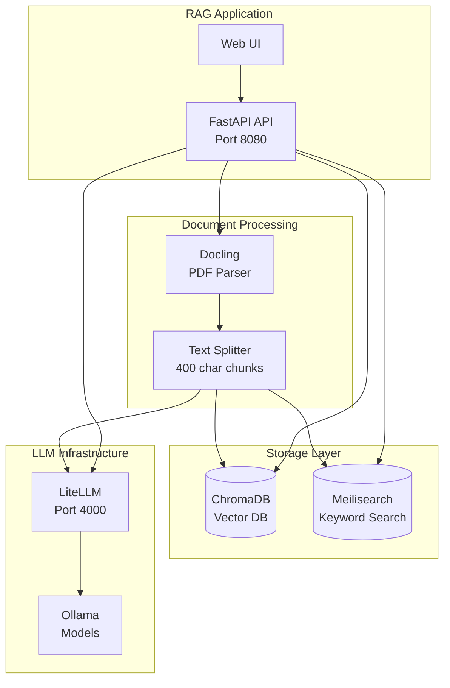

# 🤖 RAG Application (Hybrid Search + Self-Hosted LLM)

A production-ready **Retrieval-Augmented Generation (RAG)** application that combines semantic vector search with keyword search for optimal document retrieval. Built with FastAPI, LangChain, Docling, ChromaDB, and Meilisearch.

## 📑 Table of Contents

- [Architecture](#️-architecture)
- [Features](#-features)
- [Use Cases](#-use-cases)
- [Prerequisites](#-prerequisites)
  - [Infrastructure Requirements](#infrastructure-requirements)
  - [Development Prerequisites](#development-prerequisites)
  - [Environment Check](#environment-check)
- [Quick Start](#-quick-start)
  - [Option 1: Local Development](#option-1-local-development-recommended-for-testing)
  - [Option 2: Kubernetes Deployment](#option-2-kubernetes-deployment-production)
- [API Usage](#-api-usage)
- [Configuration](#️-configuration)
  - [Environment Variables](#environment-variables)
  - [Model Configuration](#model-configuration)
- [Troubleshooting](#-troubleshooting)
- [Testing](#-testing)
- [Performance Tuning](#-performance-tuning)
- [Development](#️-development)
- [Security Considerations](#-security-considerations)
- [Monitoring](#-monitoring)

---

## 🏗️ Architecture



## ✨ Features

- 📄 **Advanced PDF Parsing**: Docling for layout-aware text extraction
- 🔍 **Hybrid Search**: Combines semantic (ChromaDB) + keyword (Meilisearch) search using RRF
- 🤖 **Self-Hosted LLM**: Uses local Ollama models via LiteLLM proxy
- 💬 **Chat Interface**: Clean web UI for document Q&A
- ⚡ **Fast & Scalable**: Async FastAPI backend with batch processing
- 🔒 **Privacy-First**: All processing happens locally, no data leaves your infrastructure

## 🎯 Use Cases

- Internal company knowledge base search
- Legal/medical document Q&A systems
- Research paper analysis
- Technical documentation assistant
- Customer support knowledge retrieval

## ✅ Prerequisites

### Infrastructure Requirements
✅ **LLM Infrastructure Stack deployed** (see `../llm-infrastructure/`)
  - Ollama with models: `llama3`, `mxbai-embed-large`
  - LiteLLM proxy running
  - ChromaDB deployed
  - Meilisearch deployed

### Development Prerequisites
- **Python**: 3.11+ (3.13 recommended)
- **Kubernetes**: Access to `llm-stack` namespace
- **kubectl**: Configured and working
- **Docker**: For building container images (optional for local dev)
- **Storage**: ChromaDB and Meilisearch services available

### Environment Check
```bash
# Verify LLM infrastructure is running
kubectl get pods -n llm-stack

# Should see:
# - ollama-0 (Running)
# - litellm-xxx (Running)
# - chromadb-xxx (Running)
# - meilisearch-xxx (Running)
```

---

## 🚀 Quick Start

### For Complete Beginners

**What does this application do?**

This is a "RAG" (Retrieval-Augmented Generation) application. In simple terms:
1. You upload PDF documents
2. The app reads and understands them using AI
3. You ask questions about those documents
4. The AI finds relevant information and gives you intelligent answers

It's like having a smart assistant that has read all your documents and can answer questions about them!

**Prerequisites:**

Before starting, make sure you've completed the [LLM Infrastructure Setup](../llm-infrastructure/README.md). You need:
- ✅ Kubernetes cluster running (k3s)
- ✅ Ollama with models downloaded (llama3, mxbai-embed-large)
- ✅ LiteLLM, ChromaDB, and Meilisearch services running
- ✅ Langfuse set up for monitoring

Check everything is running:
```bash
kubectl get pods -n llm-stack
# All pods should show "Running" status
```

### Option 1: Local Development (Recommended for Testing)

This runs the app on your local machine while connecting to services in Kubernetes.

**1. Clone and Setup Python Environment**
```bash
cd rag-app

# Create a virtual environment (isolated Python installation)
python3 -m venv test

# Activate it (like switching to this Python environment)
source test/bin/activate

# Install all the required Python libraries
# This may take 5-10 minutes depending on your internet speed
pip install -r requirements.txt
```

**2. Run the Development Server**
```bash
# This script does everything automatically:
# - Connects to your Kubernetes services
# - Sets up port forwarding
# - Starts the application
./local.sh

# You should see output like:
# 🚀 Starting RAG Application in Local Development Mode
# ...
# ✅ Port-forwards established!
# ...
# Uvicorn running on http://0.0.0.0:8080
```

**3. Use the Application**

Open your web browser and go to: **http://localhost:8080**

You'll see a simple interface where you can:
- **Upload a PDF** - Click "Choose File" and select a PDF document
- **Ask Questions** - Type a question about the document
- **Get AI Answers** - The AI will read the document and answer your question

**4. Monitor with Langfuse**

While using the app, you can see what's happening behind the scenes:
```bash
# Get your node's IP
kubectl get nodes -o wide

# Open Langfuse in your browser
# http://<your-node-ip>:30000
# Example: http://192.168.1.100:30000
```

In Langfuse, you'll see:
- Every question you ask
- How the AI found relevant information
- How many "tokens" (words) were processed
- How long each step took

**5. Stop the Application**

Press `Ctrl+C` in the terminal where `local.sh` is running.

### Option 2: Kubernetes Deployment (Production)

This deploys the app permanently in Kubernetes (recommended for real use).

**1. Build the Container Image**
```bash
# This creates a Docker image with your app
docker build -t rag-api:latest .

# If using k3s, import it so Kubernetes can use it
docker save rag-api:latest | sudo k3s ctr images import -
```

**2. Deploy to Kubernetes**
```bash
kubectl apply -f k8s/02-rag-api.yaml

# Wait for it to start
kubectl wait --for=condition=ready pod -l app=rag-api -n llm-stack --timeout=300s
```

**3. Access the Application**
```bash
# Connect to it from your local machine
kubectl port-forward -n llm-stack service/rag-api 8080:8080

# Or access it directly if on the same machine:
# http://localhost:8080
```

### Option 1: Local Development (Recommended for Testing)

**1. Clone and Setup**
```bash
cd rag-app
python3 -m venv test
source test/bin/activate
pip install -r requirements.txt
```

**2. Run Local Development Server**
```bash
./local.sh
```

This script automatically:
- Kills existing port-forwards
- Sets up port-forwards to K8s services (ChromaDB, Meilisearch, LiteLLM)
- Exports environment variables
- Starts FastAPI with auto-reload

**3. Access the Application**
- **Frontend**: http://localhost:8080
- **API Docs**: http://localhost:8080/docs
- **Health Check**: http://localhost:8080/health

### Option 2: Kubernetes Deployment (Production)

**1. Build Container Image**
```bash
docker build -t rag-api:latest .

# For k3s, import the image
docker save rag-api:latest | sudo k3s ctr images import -
```

**2. Deploy to Kubernetes**
```bash
kubectl apply -f k8s/02-rag-api.yaml
```

**3. Access via Port-Forward**
```bash
kubectl port-forward -n llm-stack service/rag-api 8080:8080
```

Or configure ingress/cloudflare tunnel for external access.

---

## 📚 API Usage

### 1. Upload PDF Document
```bash
curl -X POST "http://localhost:8080/ingest" \
  -F "file=@document.pdf"
```

**Response:**
```json
{
  "status": "success",
  "message": "Indexed 45 chunks from document.pdf"
}
```

### 2. Query Documents
```bash
curl -X POST "http://localhost:8080/query" \
  -H "Content-Type: application/json" \
  -d '{"question": "What is the main topic of the document?"}'
```

**Response:**
```json
{
  "answer": "The main topic discusses...",
  "sources": [
    {
      "content": "Relevant excerpt from document...",
      "source": "document.pdf",
      "chunk_index": 3
    }
  ]
}
```

### 3. List Documents
```bash
curl "http://localhost:8080/documents"
```

### 4. Delete Document
```bash
curl -X DELETE "http://localhost:8080/documents/document.pdf"
```

---

## ⚙️ Configuration

### Environment Variables

| Variable | Default | Description |
|----------|---------|-------------|
| `CHROMA_HOST` | `chromadb.llm-stack.svc.cluster.local` | ChromaDB hostname (vector database for semantic search) |
| `CHROMA_PORT` | `8000` | ChromaDB port |
| `MEILI_HOST` | `http://meilisearch.llm-stack.svc.cluster.local:7700` | Meilisearch URL (keyword search engine) |
| `MEILI_MASTER_KEY` | `masterKey` | Meilisearch authentication key |
| `LLM_API_BASE` | `http://litellm.llm-stack.svc.cluster.local:4000` | LiteLLM proxy URL (connects to Ollama) |
| `LLM_API_KEY` | `sk-admin-secret-key` | LiteLLM API key (from secrets) |
| `EMBEDDING_MODEL` | `mxbai-embed-large` | Model for converting text to vectors (embeddings) |
| `LLM_MODEL` | `llama3` | Model for generating answers |
| `MAX_FILE_SIZE` | `52428800` | Max upload size in bytes (50MB default) |
| `LANGFUSE_HOST` | `http://localhost:30000` | Langfuse server URL (for monitoring) |
| `LANGFUSE_PUBLIC_KEY` | (from secrets) | Langfuse project public key |
| `LANGFUSE_SECRET_KEY` | (from secrets) | Langfuse project secret key |
| `LANGFUSE_ENABLED` | `true` | Enable/disable Langfuse tracing |

**For Beginners:**
- **ChromaDB** stores the "meaning" of text as numbers (vectors)
- **Meilisearch** does traditional keyword search (like Ctrl+F)
- **LiteLLM** is the "middleman" that talks to Ollama
- **Embedding Model** converts your documents into numbers the AI can understand
- **LLM Model** is the AI that reads and answers questions
- **Langfuse** records everything that happens so you can see how the AI works

### Model Configuration

**Supported Embedding Models:**
- `mxbai-embed-large` (512 tokens, recommended)
- `text-embedding-3-small` (maps to nomic-embed-text)

**Supported LLM Models:**
- `llama3` (8B parameter, fast)
- `llama3:70b` (Higher quality, slower)
- Any model available in your Ollama instance

**Chunk Size Tuning:**
Edit `app/main.py` line 308:
```python
text_splitter = RecursiveCharacterTextSplitter(
    chunk_size=400,  # Adjust based on your embedding model's limit
    chunk_overlap=50,
)
```

---

## 🔧 Troubleshooting

### Common Issues for Beginners

**1. "Cannot connect to ChromaDB/Meilisearch"**

**Problem:** The app can't reach the database services.

**Solution:**
```bash
# Check if services are running
kubectl get pods -n llm-stack

# If using local.sh, make sure port-forwards are active
ps aux | grep port-forward

# Restart local.sh if needed
./local.sh
```

**2. "Port 8080 already in use"**

**Problem:** Something else is using port 8080.

**Solution:**
```bash
# Find what's using the port
sudo lsof -i :8080

# Stop the other process, or change the port in local.sh to 8081
```

**3. "File too large" when uploading**

**Problem:** Your PDF is bigger than 50MB.

**Solution:**
- Split your PDF into smaller files
- Or increase MAX_FILE_SIZE in the environment variables

**4. "Embedding failed: Model not found"**

**Problem:** The embedding model isn't downloaded in Ollama.

**Solution:**
```bash
# Check which models are available
kubectl exec -n llm-stack statefulset/ollama -- ollama list

# Pull the missing model
kubectl exec -n llm-stack statefulset/ollama -- ollama pull mxbai-embed-large

# Restart LiteLLM to detect it
kubectl rollout restart -n llm-stack deployment/litellm
```

**5. "Connection error" when asking questions**

**Problem:** The AI model (Ollama) isn't responding.

**Solution:**
```bash
# Check if Ollama is running
kubectl get pods -n llm-stack -l app=ollama

# Check Ollama logs for errors
kubectl logs -n llm-stack statefulset/ollama

# Check if LiteLLM port-forward is active (for local dev)
ps aux | grep "port-forward.*litellm"

# Restart local.sh if port-forwards died
./local.sh
```

### Common Issues (Technical Users)

**1. "Embedding failed: 400 Bad Request"**
- **Cause**: Model not configured in LiteLLM or Ollama
- **Fix**:
  ```bash
  # Pull the model in Ollama
  kubectl exec -n llm-stack pod/ollama-0 -- ollama pull mxbai-embed-large

  # Ensure LiteLLM config includes the model (see manifests/03-litellm.yaml)
  kubectl rollout restart -n llm-stack deployment/litellm
  ```

**2. "Token indices sequence length is longer than specified"**
- **Cause**: Text chunks exceed embedding model's context window
- **Fix**: Already handled by automatic truncation in code (800 chars max)

**3. "Failed to connect to ChromaDB/Meilisearch"**
- **Cause**: Services not running or wrong hostname
- **Fix**:
  ```bash
  # Check services
  kubectl get pods -n llm-stack -l app=chromadb
  kubectl get pods -n llm-stack -l app=meilisearch

  # For local dev, ensure port-forwards are running
  ./local.sh  # Handles this automatically
  ```

**4. "Expected metadata value to be str, int, float..."**
- **Cause**: Complex metadata from Docling
- **Fix**: Already fixed - `filter_complex_metadata()` strips nested dicts

**5. Port-forward fails with "address already in use"**
```bash
# Kill existing port-forwards
pkill -f "port-forward.*chromadb"
pkill -f "port-forward.*meilisearch"
pkill -f "port-forward.*litellm"
pkill -f "port-forward.*langfuse"

# Or just run ./local.sh which handles this
```

**6. Langfuse traces not appearing**
```bash
# Check Langfuse is running
kubectl get pods -n llm-stack -l app=langfuse

# Verify LANGFUSE_ENABLED is set to true
echo $LANGFUSE_ENABLED

# Check if port-forward to Langfuse is active (for local dev)
# Should map localhost:30000 -> langfuse:3000
ps aux | grep "port-forward.*langfuse"

# Access Langfuse UI to verify it's working
# http://<node-ip>:30000 or http://localhost:30000
```

### Debug Mode

Enable verbose logging:
```python
# In app/main.py
logging.basicConfig(level=logging.DEBUG)
```

---

## 🧪 Testing

### Manual Testing
1. Start the app: `./local.sh`
2. Upload test PDF via web UI
3. Ask questions and verify responses

### API Testing
```bash
# Test health endpoint
curl http://localhost:8080/health

# Test with sample document
curl -X POST http://localhost:8080/ingest -F "file=@test.pdf"
curl -X POST http://localhost:8080/query \
  -H "Content-Type: application/json" \
  -d '{"question": "Summarize this document"}'
```

---

## 📊 Performance Tuning

### Batch Size
Adjust in `app/main.py` line 150:
```python
embeddings = LiteLLMEmbeddings(
    batch_size=5  # Increase for faster ingestion (if GPU can handle)
)
```

### Retrieval Parameters
```python
# Number of chunks to retrieve (line 245)
vector_retriever = vector_store.as_retriever(search_kwargs={"k": 5})
meili_retriever = MeilisearchRetriever(client=meili_client, index_name="rag_documents", k=5)
```

### Hybrid Search Weights
```python
# Adjust RRF weights (line 251)
ensemble_retriever = EnsembleRetriever(
    retrievers=[vector_retriever, meili_retriever],
    weights=[0.5, 0.5]  # Equal weight, adjust to favor one method
)
```

---

## 🏗️ Development

### Project Structure
```
rag-app/
├── app/
│   ├── main.py           # FastAPI application
│   └── __pycache__/
├── frontend/
│   └── index.html        # Web interface
├── k8s/
│   └── 02-rag-api.yaml   # Kubernetes deployment
├── test/                 # Python venv (gitignored)
├── Dockerfile            # Production container
├── requirements.txt      # Python dependencies
├── local.sh             # Local dev script
└── README.md
```

### Adding New Features

**Add a new endpoint:**
```python
@app.post("/custom-endpoint")
async def custom_endpoint(data: YourModel):
    # Your logic here
    return {"result": "success"}
```

**Add new document type support:**
Docling already supports: PDF, DOCX, PPTX, XLSX, Images, HTML, Markdown, AsciiDoc

---

## 🔒 Security Considerations

- **API Keys**: Rotate `LLM_API_KEY` and `MEILI_MASTER_KEY` regularly
- **File Upload**: Max size enforced (50MB default)
- **Input Validation**: Pydantic models validate all inputs
- **Network**: Use Kubernetes NetworkPolicies to restrict traffic
- **Secrets**: Store in Kubernetes Secrets, never in code

---

## 📈 Monitoring

### Health Check
```bash
curl http://localhost:8080/health
```

### Logs
```bash
# Local development
# Logs print to console

# Kubernetes
kubectl logs -n llm-stack deployment/rag-api -f
```

### Metrics (Future Enhancement)
Consider adding Prometheus metrics:
- Request count/latency
- Document ingestion time
- Embedding generation time
- Token usage tracking (via LiteLLM)

---

## 🤝 Contributing

Improvements welcome! Focus areas:
- Support for more document types
- Improved chunking strategies
- Advanced retrieval methods (HyDE, multi-query)
- Caching layer for frequent queries
- Async document processing queue

---

## 📝 License

See LICENSE file in root directory.

---

## 🆘 Support

For issues:
1. Check logs: `kubectl logs -n llm-stack deployment/rag-api`
2. Verify infrastructure: `kubectl get pods -n llm-stack`
3. Test models directly: `kubectl exec -n llm-stack pod/ollama-0 -- ollama run llama3`

## Quick Start

### 1. Add Meilisearch Secret

You need to add a master key for Meilisearch to your existing secret.
Run this to patch your secret (Change `my-master-key` to a secure password):
```bash
kubectl patch secret llm-stack-secret -n llm-stack --type='json' -p='[{"op" : "add" ,"path" : "/data/meili-master-key" ,"value" : "'"$(echo -n 'my-master-key' | base64)"'"}]'
```

### 2. Deploy Infrastructure

```bash
# Vector DB
kubectl apply -f k8s/01-chromadb.yaml

# Search Engine (New)
kubectl apply -f k8s/03-meilisearch.yaml
```

Wait for Meilisearch to be ready:
```bash
kubectl wait --for=condition=ready pod -l app=meilisearch -n llm-stack --timeout=60s
```

### 3. Build & Deploy API

```bash
# Build
docker build -t rag-api:v3 .

# Import to K3s (if using k3s)
docker save rag-api:v3 | sudo k3s ctr images import -

# Deploy
kubectl apply -f k8s/02-rag-api.yaml
```

## Architecture

```
          ┌──────────────┐
          │  PDF Ingest  │
          └──────┬───────┘
                 │
        ┌────────┴────────┐
        ▼                 ▼
  ┌────────────┐    ┌─────────────┐
  │  ChromaDB  │    │ Meilisearch │
  │ (Vectors)  │    │ (Keywords)  │
  └─────┬──────┘    └──────┬──────┘
        │                  │
        └───────┬──────────┘
                ▼
           RRF Fusion
                ▼
               LLM
```

## Troubleshooting

### Meilisearch Connection
If the app log says "Failed to connect to Meilisearch":
1. Check Pod status: `kubectl get pods -n llm-stack -l app=meilisearch`
2. Check Service: `kubectl get svc -n llm-stack meilisearch` (Should be port 7700)
3. verify Secret: Ensure `MEILI_MASTER_KEY` is set correctly in the secret.

### Ingestion Errors
If ingestion fails, check if the `libgl` dependencies are installed (should be fixed in v3 Dockerfile).
